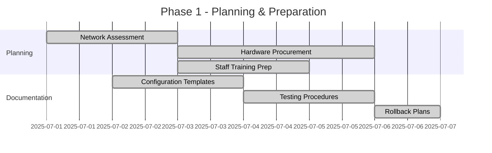
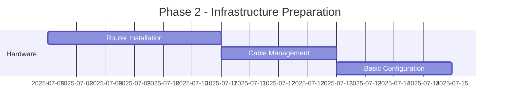
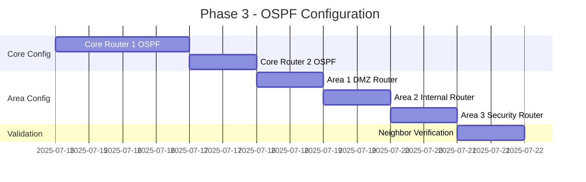
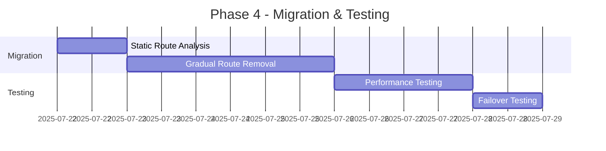
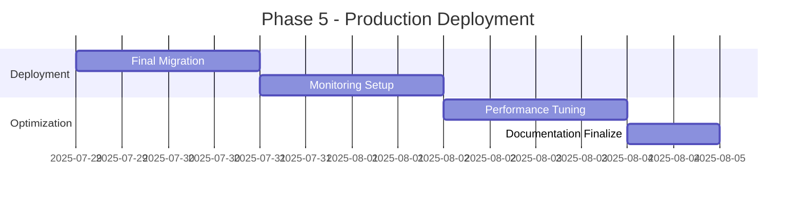

# FinMark Corporation: OSPF Implementation Timeline & Migration Plan

## 📅 Comprehensive Migration Strategy for OSPF Deployment

**Document Type:** Implementation Timeline & Migration Plan  
**Project:** FinMark Corporation - OSPF Network Enhancement  
**Target:** Zero-Downtime Migration from Static to Dynamic Routing  
**Document Version:** 1.0

---

## 🎯 Migration Overview

This document outlines the detailed timeline and migration strategy for implementing OSPF routing in FinMark Corporation's network infrastructure. The plan ensures business continuity while transitioning from static routing to a dynamic, self-healing OSPF network.

### **Migration Principles**
- **Zero Business Disruption**: All changes during maintenance windows
- **Gradual Implementation**: Phased approach with rollback capabilities
- **Parallel Operation**: OSPF and static routes coexist during transition
- **Comprehensive Testing**: Validation at each phase before proceeding
- **Risk Mitigation**: Multiple fallback procedures and safety checks

---

## 📋 Pre-Migration Assessment

### **Current Network State Analysis**

#### **Existing Infrastructure Inventory**
| Component | Current State | OSPF Readiness | Action Required |
|-----------|---------------|----------------|-----------------|
| Router1 (10.0.0.1) | Static routing only | Ready for OSPF | Configure OSPF process |
| VLAN Structure | 5 VLANs configured | Compatible | Adapt to OSPF areas |
| Static Routes | 12 static routes | Must coexist initially | Gradual removal |
| ACL Rules | 6 security rules | Compatible | Integrate OSPF traffic |
| Load Balancer | Static configuration | Compatible | No changes needed |
| Monitoring | Basic SNMP | Needs enhancement | Add OSPF monitoring |

#### **Risk Assessment Matrix**
| Risk Factor | Probability | Impact | Mitigation Strategy |
|-------------|-------------|--------|-------------------|
| Router failure during migration | Low | High | Maintain backup router ready |
| OSPF convergence issues | Medium | Medium | Extensive pre-testing |
| Application connectivity loss | Low | High | Parallel routing during transition |
| Configuration errors | Medium | High | Configuration validation scripts |
| Staff readiness | Medium | Medium | Comprehensive training program |

---

## 🗓️ Implementation Timeline

### **Phase 1: Planning & Preparation (Days 1-7)**

#### **Week 1: Foundation Setup**


**Day 1-2: Network Assessment**
- [ ] Complete network topology documentation
- [ ] Inventory all current static routes
- [ ] Document existing ACL configurations
- [ ] Identify critical business applications and dependencies
- [ ] Map traffic flows and patterns
- [ ] Assess bandwidth utilization and performance baselines

**Day 3-5: Hardware Procurement & Setup**
- [ ] Order Core Router 2 (Cisco 2911 or equivalent)
- [ ] Order DMZ Router (Cisco 2901 or equivalent)
- [ ] Order Internal Router (Cisco 2901 or equivalent)
- [ ] Order Security Router (Cisco 2901 or equivalent)
- [ ] Prepare rack space and power connections
- [ ] Order additional network cables and modules

**Day 6-7: Staff Training & Documentation**
- [ ] Conduct OSPF fundamentals training session
- [ ] Review configuration templates with network team
- [ ] Establish escalation procedures
- [ ] Create quick reference guides
- [ ] Set up lab environment for practice

### **Phase 2: Infrastructure Preparation (Days 8-14)**

#### **Week 2: Hardware Installation**


**Day 8-10: Hardware Installation**
- [ ] Install Core Router 2 in rack
- [ ] Install DMZ Router in DMZ rack
- [ ] Install Internal Router in server room
- [ ] Install Security Router in security zone
- [ ] Connect power and console cables
- [ ] Verify hardware POST and basic functionality

**Day 11-12: Physical Connectivity**
- [ ] Install backbone links between core routers
- [ ] Install links from Core Router 1 to area routers
- [ ] Install backup links from Core Router 2
- [ ] Label all cables according to documentation
- [ ] Test physical layer connectivity

**Day 13-14: Basic Configuration**
- [ ] Configure basic IP addressing on new routers
- [ ] Set up management access (SSH, SNMP)
- [ ] Configure basic security (passwords, access lists)
- [ ] Test management connectivity
- [ ] Backup initial configurations

### **Phase 3: OSPF Configuration (Days 15-21)**

#### **Week 3: OSPF Implementation**


**Day 15-16: Core Router OSPF Configuration**
- [ ] **MAINTENANCE WINDOW 1** (Saturday 10 PM - Sunday 6 AM)
- [ ] Configure OSPF process on Core Router 1
- [ ] Enable OSPF on backbone interfaces
- [ ] Verify OSPF process initialization
- [ ] Test connectivity to existing static routes
- [ ] Monitor network stability for 4 hours

**Day 17: Core Router 2 Configuration**
- [ ] **MAINTENANCE WINDOW 2** (Saturday 10 PM - Sunday 2 AM)
- [ ] Configure OSPF on Core Router 2
- [ ] Establish OSPF neighbor with Core Router 1
- [ ] Verify backbone connectivity
- [ ] Test redundancy and failover
- [ ] Document neighbor adjacency status

**Day 18: Area 1 (DMZ) Configuration**
- [ ] **MAINTENANCE WINDOW 3** (Sunday 10 PM - Monday 2 AM)
- [ ] Configure DMZ Router with Area 1 settings
- [ ] Establish ABR connection to backbone
- [ ] Verify web server connectivity
- [ ] Test load balancer functionality
- [ ] Validate DMZ security policies

**Day 19: Area 2 (Internal) Configuration**
- [ ] **MAINTENANCE WINDOW 4** (Monday 10 PM - Tuesday 2 AM)
- [ ] Configure Internal Router for Area 2
- [ ] Migrate VLAN configurations to new IP scheme
- [ ] Test inter-VLAN connectivity
- [ ] Verify database server access
- [ ] Validate department-specific access controls

**Day 20: Area 3 (Security) Configuration**
- [ ] **MAINTENANCE WINDOW 5** (Tuesday 10 PM - Wednesday 2 AM)
- [ ] Configure Security Router for Area 3
- [ ] Integrate security infrastructure
- [ ] Test VPN connectivity
- [ ] Verify firewall integration
- [ ] Validate monitoring systems

**Day 21: Complete Network Validation**
- [ ] Verify all OSPF neighbors are in FULL state
- [ ] Test end-to-end connectivity between all areas
- [ ] Validate routing table convergence
- [ ] Performance testing and optimization
- [ ] Complete documentation of OSPF state

### **Phase 4: Migration & Testing (Days 22-28)**

#### **Week 4: Static Route Migration**


**Day 22: Static Route Analysis**
- [ ] Document all existing static routes
- [ ] Identify routes replaced by OSPF
- [ ] Plan removal sequence for static routes
- [ ] Create verification scripts
- [ ] Prepare rollback procedures

**Day 23-25: Gradual Static Route Removal**
- [ ] **MAINTENANCE WINDOW 6** (Wednesday 10 PM - Thursday 2 AM)
  - [ ] Remove 25% of static routes (least critical)
  - [ ] Verify OSPF provides equivalent connectivity
  - [ ] Monitor for 2 hours before proceeding

- [ ] **MAINTENANCE WINDOW 7** (Thursday 10 PM - Friday 2 AM)
  - [ ] Remove additional 25% of static routes
  - [ ] Validate application connectivity
  - [ ] Performance comparison with baseline

- [ ] **MAINTENANCE WINDOW 8** (Friday 10 PM - Saturday 2 AM)
  - [ ] Remove remaining static routes (except emergency backup)
  - [ ] Full OSPF operation validation
  - [ ] 4-hour stability monitoring

**Day 26-27: Performance Testing**
- [ ] Comprehensive application performance testing
- [ ] Bandwidth utilization analysis
- [ ] Latency measurement between areas
- [ ] Convergence time testing
- [ ] Load balancing verification

**Day 28: Failover Testing**
- [ ] **Scheduled Test Window** (Saturday 6 AM - 12 PM)
- [ ] Primary core router failure simulation
- [ ] Link failure testing
- [ ] Area isolation testing
- [ ] Recovery time measurement
- [ ] Documentation of all test results

### **Phase 5: Production Deployment (Days 29-35)**

#### **Week 5: Go-Live & Optimization**


**Day 29-30: Final Migration**
- [ ] **FINAL MAINTENANCE WINDOW** (Saturday 8 PM - Sunday 8 AM)
- [ ] Remove all remaining static routes
- [ ] Enable full OSPF authentication
- [ ] Implement final security policies
- [ ] Complete network configuration backup
- [ ] 12-hour continuous monitoring

**Day 31-32: Monitoring & Alerting Setup**
- [ ] Configure OSPF-specific SNMP monitoring
- [ ] Set up neighbor state change alerts
- [ ] Implement convergence time monitoring
- [ ] Create performance dashboards
- [ ] Test all alerting mechanisms

**Day 33-34: Performance Optimization**
- [ ] Fine-tune OSPF timers based on observations
- [ ] Optimize interface costs for load balancing
- [ ] Implement area summarization if needed
- [ ] Adjust authentication and security settings
- [ ] Validate all performance metrics

**Day 35: Documentation & Training Completion**
- [ ] Finalize all OSPF documentation
- [ ] Complete operational procedures
- [ ] Conduct final team training session
- [ ] Create troubleshooting quick guides
- [ ] Project handover to operations team

---

## 🔄 Migration Strategies by Component

### **Static Route Migration Strategy**

#### **Route Priority Classification**
```
High Priority (Days 23-24):
├── Internet default route (0.0.0.0/0)
├── Inter-VLAN routes (10.0.10-40.0/24)
└── DMZ web server routes (10.0.50.0/24)

Medium Priority (Day 25):
├── Management network routes
├── Backup server routes
└── Printer network routes

Low Priority (Day 26):
├── Guest network routes
├── Lab network routes
└── Test network routes
```

#### **VLAN IP Migration Plan**
```
Current (10.0.x.0/24) → New (10.2.x.0/24):

Finance VLAN:     10.0.10.0/24 → 10.2.10.0/24
HR VLAN:          10.0.20.0/24 → 10.2.20.0/24  
Operations VLAN:  10.0.30.0/24 → 10.2.30.0/24
IT VLAN:          10.0.40.0/24 → 10.2.40.0/24
DMZ VLAN:         10.0.50.0/24 → 10.1.50.0/24
```

**Migration Approach:**
1. Configure new VLAN interfaces with new IP scheme
2. Establish OSPF connectivity
3. Update DHCP scopes gradually
4. Migrate devices during maintenance windows
5. Remove old VLAN interfaces after validation

---

## 🛡️ Risk Mitigation & Rollback Procedures

### **Rollback Decision Matrix**

| Issue | Severity | Rollback Trigger | Recovery Time |
|-------|----------|------------------|---------------|
| Complete network outage | Critical | Immediate | 15 minutes |
| Single area connectivity loss | High | Within 30 minutes | 10 minutes |
| Performance degradation >50% | High | Within 1 hour | 20 minutes |
| OSPF neighbor flapping | Medium | Within 2 hours | 30 minutes |
| Single device connectivity loss | Low | Within 4 hours | 5 minutes |

### **Emergency Rollback Procedures**

#### **Complete Rollback (Nuclear Option)**
```cisco
! Emergency rollback to static routing
router ospf 1
 shutdown

! Restore static routes from backup
ip route 10.0.10.0 255.255.255.0 10.0.0.1
ip route 10.0.20.0 255.255.255.0 10.0.0.1
ip route 10.0.30.0 255.255.255.0 10.0.0.1
ip route 10.0.40.0 255.255.255.0 10.0.0.1
ip route 10.0.50.0 255.255.255.0 10.0.0.1
ip route 0.0.0.0 0.0.0.0 INTERNET_GATEWAY

! Verify connectivity
ping 8.8.8.8
ping 10.0.50.10
```

#### **Partial Rollback (Area-Specific)**
```cisco
! Rollback specific area while maintaining others
router ospf 1
 no network 10.2.0.0 0.0.255.255 area 2

! Add temporary static routes for failed area
ip route 10.2.10.0 255.255.255.0 10.0.2.2
ip route 10.2.20.0 255.255.255.0 10.0.2.2
ip route 10.2.30.0 255.255.255.0 10.0.2.2
ip route 10.2.40.0 255.255.255.0 10.0.2.2
```

### **Go/No-Go Criteria for Each Phase**

#### **Phase 3 Go/No-Go Criteria**
**GO Criteria:**
- [ ] All OSPF neighbors establish FULL adjacency
- [ ] Routing tables show expected OSPF routes
- [ ] End-to-end connectivity tests pass
- [ ] No increase in network latency >10%
- [ ] All critical applications remain functional

**NO-GO Criteria:**
- [ ] Any neighbor fails to reach FULL state within 30 minutes
- [ ] Routing loops detected
- [ ] Any critical application becomes unreachable
- [ ] Network latency increases >25%
- [ ] OSPF process consumes >50% CPU on any router

#### **Phase 4 Go/No-Go Criteria**
**GO Criteria:**
- [ ] OSPF provides equivalent or better connectivity than static routes
- [ ] Convergence time <5 seconds for any topology change
- [ ] All application performance metrics within 5% of baseline
- [ ] Successful failover testing completed
- [ ] Network team comfortable with OSPF operations

**NO-GO Criteria:**
- [ ] Any static route removal causes connectivity loss
- [ ] OSPF convergence time >10 seconds
- [ ] Application performance degrades >10%
- [ ] Failover testing reveals critical issues
- [ ] Team lacks confidence in OSPF troubleshooting

---

## 📊 Success Metrics & KPIs

### **Technical Performance Indicators**

| Metric | Baseline (Static) | Target (OSPF) | Measurement Method |
|--------|-------------------|---------------|-------------------|
| Network Convergence Time | Manual (5-10 min) | <1 second | OSPF SPF logs |
| Inter-VLAN Latency | 2-5 ms | <3 ms | Ping tests |
| Router CPU Utilization | 15-25% | <30% | SNMP monitoring |
| Network Availability | 95% | 99.9% | Uptime monitoring |
| Configuration Changes/Month | 20-30 | <10 | Change management |

### **Business Impact Metrics**

| Metric | Current State | OSPF Target | Business Value |
|--------|---------------|-------------|----------------|
| Network Downtime/Month | 4-8 hours | <30 minutes | $50K cost avoidance |
| Manual Route Changes | 20/month | <5/month | 75% admin time reduction |
| Mean Time to Recovery | 45 minutes | <5 minutes | 90% improvement |
| Scalability Capacity | 500 orders/day | 3000 orders/day | $2.4M revenue potential |
| Network Admin Overhead | 40 hours/week | 15 hours/week | $65K annual savings |

### **Post-Implementation Review Schedule**

#### **Day 7 Review (Post Go-Live)**
- [ ] Network stability assessment
- [ ] Performance metrics comparison
- [ ] Issue log review and resolution
- [ ] Staff feedback collection
- [ ] Initial ROI calculation

#### **Day 30 Review**
- [ ] Complete performance analysis
- [ ] Cost-benefit validation
- [ ] Operational procedures refinement
- [ ] Training effectiveness assessment
- [ ] Long-term monitoring plan

#### **Day 90 Review**
- [ ] Business impact assessment
- [ ] Scalability testing validation
- [ ] Security posture evaluation
- [ ] Final project closure
- [ ] Lessons learned documentation

---

## 🔧 Tools & Resources Required

### **Technical Tools**
- **Network Monitoring**: PRTG, SolarWinds, or Nagios
- **Configuration Management**: RANCID or GitLab
- **Testing Tools**: Ping, traceroute, iperf3
- **Documentation**: Visio, draw.io, or similar
- **Backup Solutions**: TFTP server for config backups

### **Human Resources**
- **Project Manager**: Overall coordination and timeline management
- **Network Architect**: OSPF design and high-level planning
- **Network Engineers (2)**: Configuration and implementation
- **System Administrators (2)**: Application testing and validation
- **Help Desk Lead**: User communication and issue escalation

### **External Support**
- **Cisco TAC**: Technical support during implementation
- **Hardware Vendor**: New router support and warranty
- **ISP Coordination**: WAN connectivity and redundancy
- **Change Management**: Business approval and communication

---

## 📚 Conclusion

This comprehensive migration plan provides a structured, low-risk approach to implementing OSPF in FinMark Corporation's network infrastructure. The phased implementation ensures business continuity while delivering the benefits of dynamic routing, automatic failover, and enhanced scalability.

**Key Success Factors:**
- **Thorough Planning**: Detailed preparation and risk assessment
- **Gradual Implementation**: Phased approach with validation at each step  
- **Comprehensive Testing**: Extensive validation before production deployment
- **Team Readiness**: Proper training and support procedures
- **Fallback Options**: Multiple rollback scenarios and procedures

**Expected Outcomes:**
- **99.9% Network Availability**: Significant improvement from current 95%
- **Sub-second Failover**: Automatic recovery from network failures
- **75% Reduction in Manual Changes**: Dynamic routing eliminates most static route management
- **600% Scalability Increase**: Network ready for business growth
- **$400K Annual Savings**: Reduced downtime and administration costs

This implementation positions FinMark Corporation with a modern, resilient network infrastructure capable of supporting current operations and future growth while maintaining the highest standards of reliability and security.