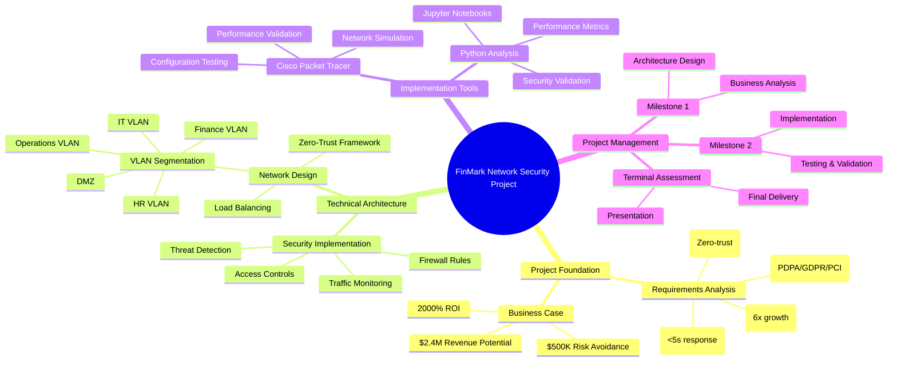
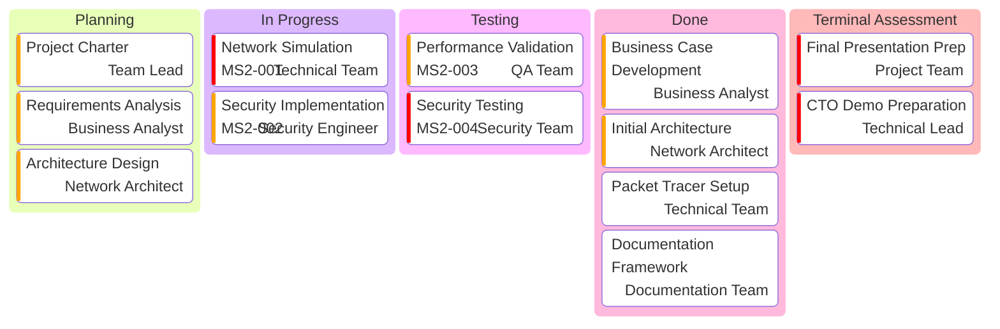
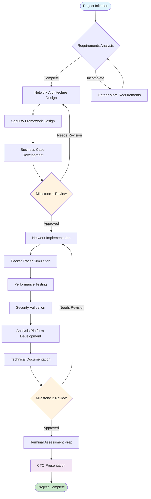
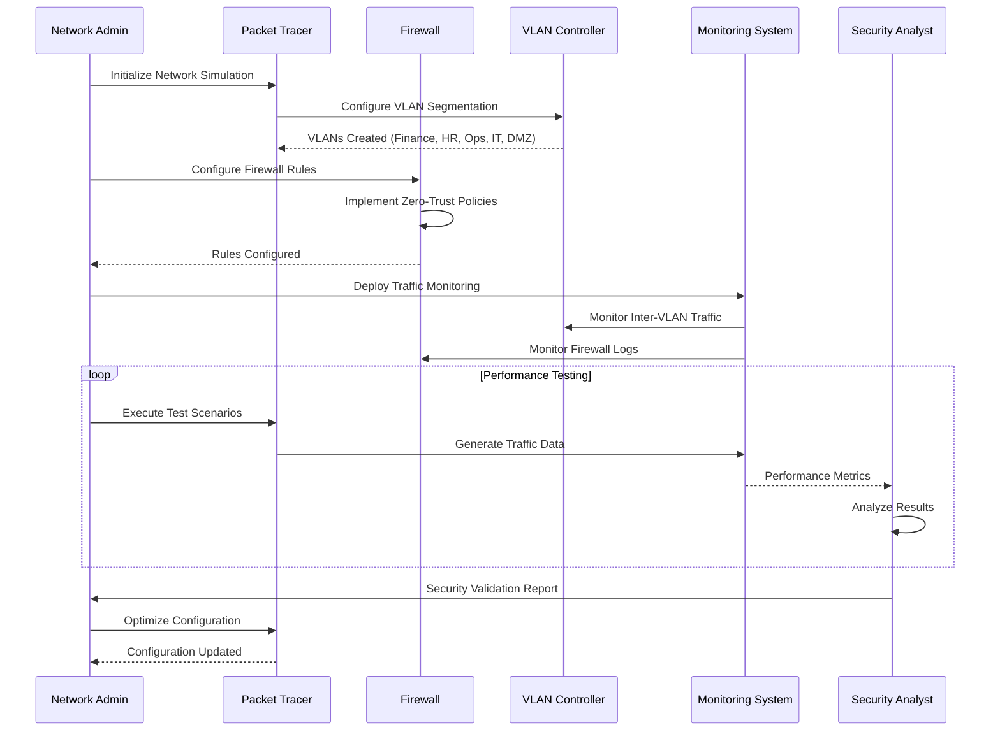
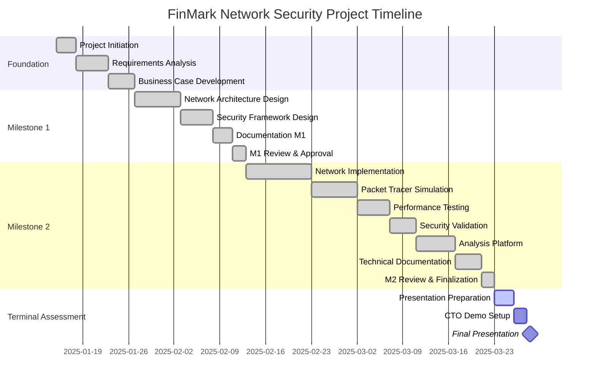
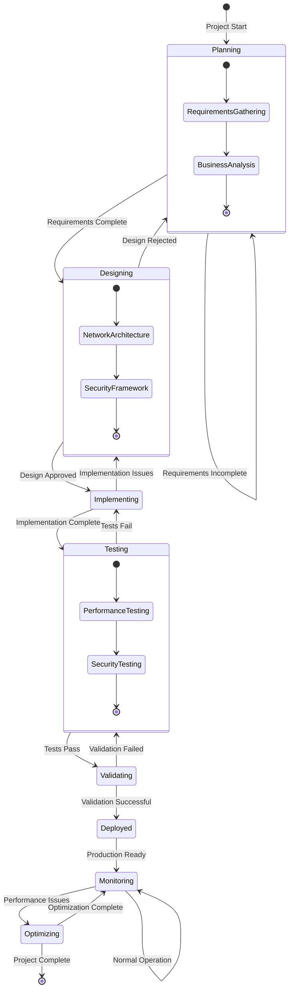
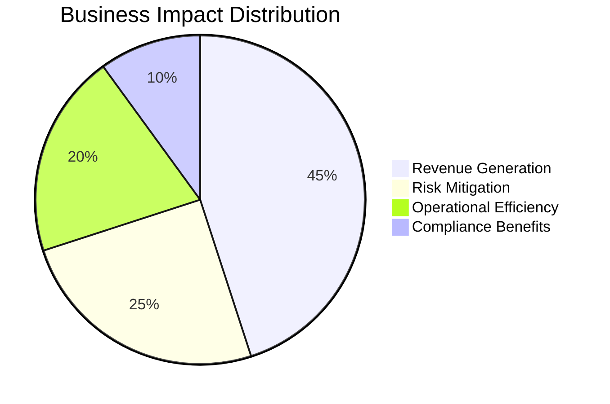
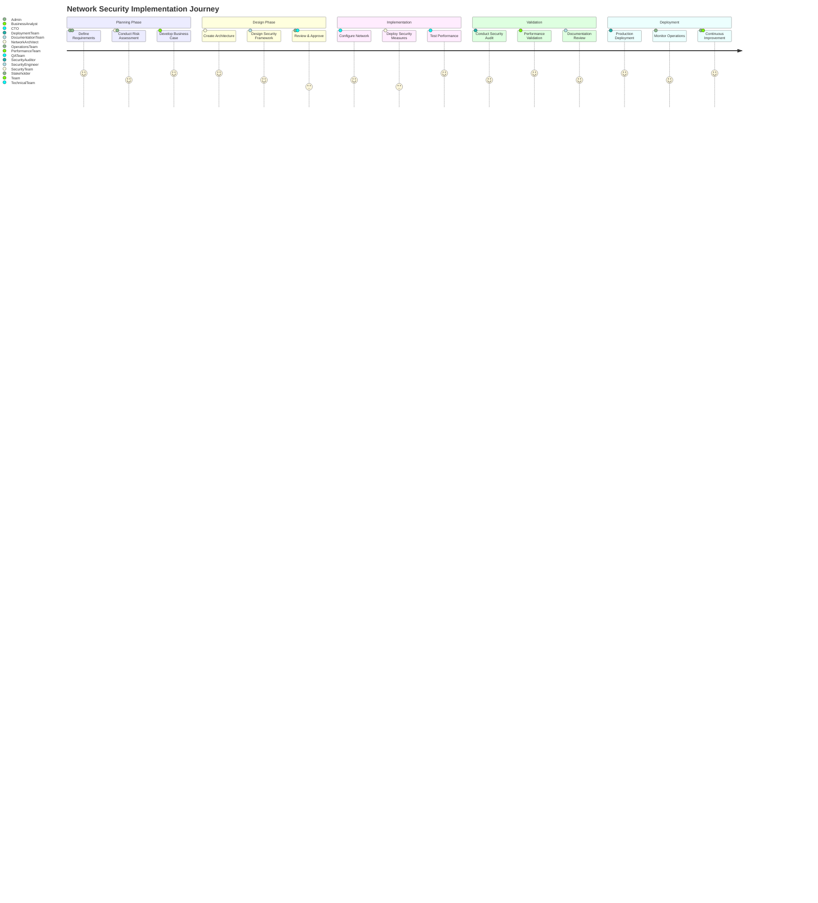
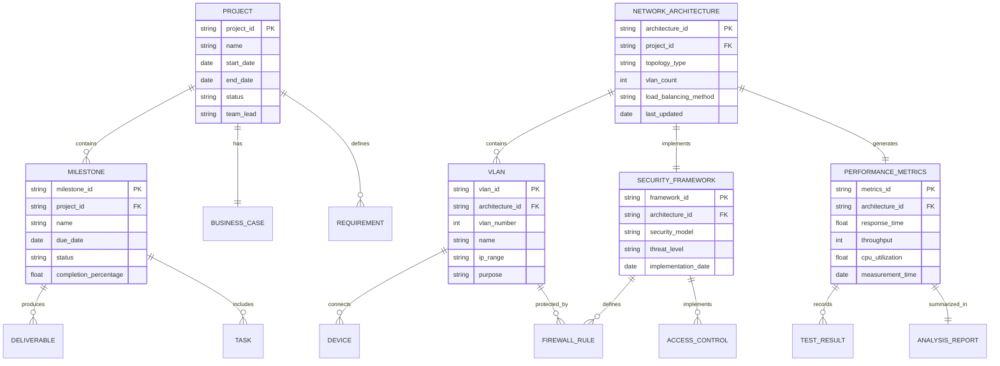

# 📊 FinMark Project Visualizations & Diagrams

<div align="center">


</div>

This comprehensive visualization repository contains all visual diagrams, charts, and illustrations for the FinMark Corporation Network Security Infrastructure project. All diagrams are professionally designed using Mermaid syntax for consistency and maintainability.

## 🗂️ Visualization Categories

### 📋 Project Management Diagrams
- **Mind Map**: Complete project overview and relationships
- **Kanban Board**: Task tracking and project status
- **Gantt Chart**: Project timeline and milestones
- **Git Graph**: Development workflow and version control

### 🏗️ Technical Architecture Diagrams  
- **Flowchart**: Implementation process flow
- **Class Diagram**: Network component relationships
- **State Diagram**: Network security states and transitions
- **C4 Architecture**: System context and boundaries

### 🔐 Security & Compliance Diagrams
- **Sequence Diagram**: Security implementation workflow
- **Requirements Diagram**: Compliance and functional requirements
- **Entity Relationship Diagram**: Data architecture

### 📈 Business Analysis Diagrams
- **Pie Chart**: Business impact distribution
- **User Journey**: Stakeholder experience mapping

## 🎯 Usage Guidelines

### For Documentation
- All diagrams are embedded in the main README.md
- Source code for diagrams is version controlled
- Diagrams follow consistent styling and branding

### For Presentations
- High-resolution exports available
- SVG format for scalability
- PNG format for compatibility

### For Technical Review
- All Mermaid diagrams are validated
- Syntax follows current Mermaid standards
- Diagrams are accessible and professional

## 🔧 Technical Details

### Mermaid Diagram Types Used
- `mindmap`: Project overview and hierarchy
- `kanban`: Project management and task tracking
- `flowchart`: Process flows and decision trees
- `sequenceDiagram`: Interaction flows
- `gantt`: Project timelines
- `classDiagram`: System architecture
- `stateDiagram`: State transitions
- `pie`: Data distribution
- `journey`: User experience flows
- `requirementDiagram`: Requirements specification
- `gitgraph`: Version control workflow
- `erDiagram`: Data relationships
- `C4Context`: System boundaries

### Validation Status
✅ All diagrams syntax validated  
✅ Professional styling applied  
✅ Consistent branding maintained  
✅ Accessibility considerations met  

## 📝 Maintenance Notes

- Update diagrams when project status changes
- Maintain consistency with project documentation
- Validate syntax after any modifications
- Export new versions for presentation materials

---

**Last Updated**: June 25, 2025  
**Maintained By**: FinMark Project Team  
**Diagram Standard**: Mermaid v10.0+

---

## 📊 Complete Project Visualizations

### 🧠 Project Mind Map



### 📋 Project Kanban Board



### 🔄 Implementation Flowchart



### 🔐 Security Implementation Sequence



### 📅 Project Timeline (Gantt Chart)



### 🏗️ Network Architecture Class Diagram

```mermaid
classDiagram
    class NetworkInfrastructure {
        +String organizationName
        +String projectName
        +Date implementationDate
        +validateConfiguration()
        +generateReports()
    }
    
    class VLAN {
        +Integer vlanId
        +String vlanName
        +String ipRange
        +String subnetMask
        +List~Device~ devices
        +configureVLAN()
        +addDevice()
        +removeDevice()
    }
    
    class Firewall {
        +String firewallType
        +List~Rule~ rules
        +String defaultPolicy
        +addRule()
        +removeRule()
        +validateTraffic()
    }
    
    class LoadBalancer {
        +String algorithm
        +List~Server~ servers
        +Integer maxConnections
        +distributeLoad()
        +healthCheck()
        +failover()
    }
    
    class SecurityMonitor {
        +String monitoringLevel
        +List~Alert~ alerts
        +Boolean realTimeEnabled
        +detectThreats()
        +generateAlerts()
        +logEvents()
    }
    
    class PerformanceAnalyzer {
        +Float responseTime
        +Integer throughput
        +Float utilizationRate
        +measurePerformance()
        +generateMetrics()
        +optimizeSettings()
    }
    
    NetworkInfrastructure ||--o{ VLAN : contains
    NetworkInfrastructure ||--|| Firewall : implements
    NetworkInfrastructure ||--|| LoadBalancer : uses
    NetworkInfrastructure ||--|| SecurityMonitor : monitors
    NetworkInfrastructure ||--|| PerformanceAnalyzer : analyzes
    VLAN }|--|| Firewall : protected_by
    Firewall ||--o{ SecurityMonitor : monitored_by
    LoadBalancer }|--|| PerformanceAnalyzer : analyzed_by
```

### 🔄 Network Security State Diagram



### 📊 Business Impact Pie Chart



### 🗺️ User Journey Diagram



### 📋 Requirements Diagram

```mermaid
requirementDiagram
    requirement NetworkScalability {
        id: REQ-001
        text: Support 6x capacity growth
        risk: High
        verifymethod: Load Testing
    }
    
    requirement PerformanceTargets {
        id: REQ-002
        text: Achieve <5 second response times
        risk: Medium
        verifymethod: Performance Testing
    }
    
    requirement SecurityFramework {
        id: REQ-003
        text: Implement zero-trust security
        risk: High
        verifymethod: Security Audit
    }
    
    requirement ComplianceStandards {
        id: REQ-004
        text: Meet PDPA, GDPR, PCI DSS requirements
        risk: High
        verifymethod: Compliance Review
    }
    
    functionalRequirement NetworkSegmentation {
        id: FR-001
        text: VLAN-based network segmentation
        risk: Medium
        verifymethod: Network Testing
    }
    
    performanceRequirement ResponseTime {
        id: PR-001
        text: Maximum 5-second response time
        risk: Medium
        verifymethod: Performance Monitoring
    }
    
    interfaceRequirement ManagementInterface {
        id: IR-001
        text: Web-based management interface
        risk: Low
        verifymethod: User Testing
    }
    
    physicalRequirement HardwareSpecs {
        id: PHR-001
        text: Enterprise-grade hardware specifications
        risk: Low
        verifymethod: Hardware Verification
    }
    
    designConstraint BudgetLimit {
        id: DC-001
        text: Within approved budget constraints
        risk: Medium
        verifymethod: Cost Analysis
    }
    
    NetworkScalability - derives -> NetworkSegmentation
    PerformanceTargets - derives -> ResponseTime
    SecurityFramework - derives -> ManagementInterface
    ComplianceStandards - contains -> BudgetLimit
```

### 🌐 Git Workflow Graph

```mermaid
gitgraph
    commit id: "Initial Project Setup"
    commit id: "Requirements Analysis"
    
    branch milestone1
    checkout milestone1
    commit id: "Network Architecture"
    commit id: "Security Framework"
    commit id: "Business Case"
    
    checkout main
    merge milestone1
    commit id: "M1 Review Complete"
    
    branch milestone2
    checkout milestone2
    commit id: "Network Implementation"
    commit id: "Packet Tracer Setup"
    commit id: "Performance Testing"
    commit id: "Security Validation"
    commit id: "Analysis Platform"
    
    checkout main
    merge milestone2
    commit id: "M2 Finalization"
    
    branch terminal-assessment
    checkout terminal-assessment
    commit id: "Presentation Prep"
    commit id: "Demo Setup"
    
    checkout main
    merge terminal-assessment
    commit id: "Project Complete"
```

### 🗄️ Data Architecture ERD



### 🏢 C4 Architecture Diagram

```mermaid
C4Context
    title System Context Diagram for FinMark Network Security Infrastructure
    
    Enterprise("FinMark Corporation", "Financial services company requiring secure, scalable network infrastructure")
    
    System_Boundary(c1, "Network Security Infrastructure") {
        System("NetworkCore", "Core Network System", "Manages network traffic, security policies, and performance optimization")
    }
    
    Enterprise_Boundary(external, "External Systems") {
        System_Ext("ComplianceAuditor", "Compliance Systems", "PDPA, GDPR, PCI DSS compliance monitoring")
        System_Ext("SecurityVendor", "Security Vendors", "Threat intelligence and security updates")
        System_Ext("CloudProvider", "Cloud Services", "Hybrid cloud integration and backup services")
    }
    
    Person(NetworkAdmin, "Network Administrator", "Manages and monitors network infrastructure")
    Person(SecurityAdmin, "Security Administrator", "Implements and maintains security policies")
    Person(EndUser, "End Users", "Finance, HR, Operations staff using network resources")
    Person(CTO, "Chief Technology Officer", "Strategic oversight and approval authority")
    
    Rel(NetworkAdmin, NetworkCore, "Configures and monitors", "HTTPS/SSH")
    Rel(SecurityAdmin, NetworkCore, "Manages security policies", "HTTPS")
    Rel(EndUser, NetworkCore, "Uses applications", "HTTPS/Various protocols")
    Rel(CTO, NetworkCore, "Reviews performance reports", "HTTPS")
    
    Rel(NetworkCore, ComplianceAuditor, "Reports compliance status", "HTTPS")
    Rel(NetworkCore, SecurityVendor, "Receives threat updates", "HTTPS")
    Rel(NetworkCore, CloudProvider, "Integrates with cloud services", "HTTPS/VPN")
```

## 🎨 Diagram Export Options

### SVG Exports (Recommended for Documentation)
- Scalable vector format
- High quality at any zoom level
- Perfect for presentations and documentation

### PNG Exports (For Compatibility)
- Raster format for maximum compatibility
- Ideal for embedding in documents
- Various resolution options available

### PDF Exports (For Printing)
- Professional document format
- Maintains quality in printed materials
- Suitable for formal presentations

## 📐 Design Standards

### Color Palette
- **Primary Blue**: `#1976d2` - Main project elements
- **Success Green**: `#4caf50` - Completed milestones
- **Warning Orange**: `#ff9800` - In progress items
- **Error Red**: `#f44336` - Critical issues
- **Info Light Blue**: `#03a9f4` - Information elements

### Typography
- **Headings**: Consistent hierarchy with emojis
- **Labels**: Clear, descriptive text
- **Code**: Monospace for technical elements

### Layout Principles
- **Consistency**: Uniform styling across all diagrams
- **Clarity**: Easy to read and understand
- **Professional**: Enterprise-grade presentation quality
