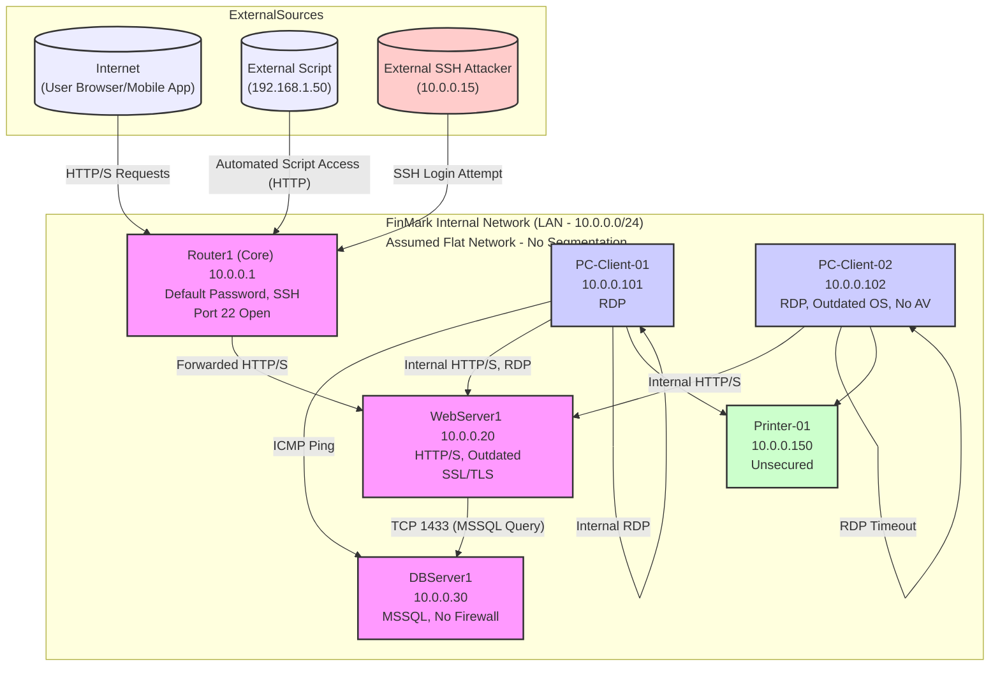

## Networking and Cybersecurity Architecture Template

Task Title: Finalized Network Diagram with Firewall, Security, and Performance-Enhancing Measures
Platform Context: FinMark – Financial Technology Platform
Target Output: Two Network Diagrams (Current + Proposed) + Short Explanation (Slides)

---

### Part 1: Current Network Infrastructure

1. Describe the assumed current network setup.

Based on the provided network_inventory.csv, traffic_logs.csv, and project context:

 Devices or Components Likely Present:

   Router1 (10.0.0.1): Core Router, Cisco IOS. Handles HTTP, SSH. Currently using a default password.
   WebServer1 (10.0.0.20): Web Server, Ubuntu 18.04. Serves HTTP/HTTPS. SSL/TLS is outdated.
   DBServer1 (10.0.0.30): DB Server, Windows 2012. Uses MSSQL (port 1433). No dedicated firewall is active on this server.
   PC-Client-01 (10.0.0.101): User PC, Windows 10 Pro. Uses RDP.
   PC-Client-02 (10.0.0.102): User PC, Windows 10 Home. Uses RDP. OS is outdated, and no antivirus is installed.
   Printer-01 (10.0.0.150): Network Printer. Uses RAW protocol on port 9100. Unsecured, no password.
   Firewall: No dedicated network firewall device is explicitly mentioned in the inventory. Basic OS-level firewalls might be present but are not configured optimally (e.g., DBServer1 has no firewall).
   DNS/CDN/Load Balancers: Not explicitly mentioned in the current setup. Given the performance issues (dashboard load times, system slowdowns), these are likely absent or insufficient.
   Access Control Systems: Basic, as evidenced by "Unauthorized access incidents" and reliance on default passwords.
 Cloud or Hosting Services:

   The network_inventory.csv suggests an on-premises infrastructure. While FinMark aims for a SaaS platform, the current described hardware points to local hosting.
 Data Flow from External Internet to Internal System:

   External user requests (HTTP/HTTPS) likely hit `Router1`, which forwards them to `WebServer1`.
   `WebServer1` processes requests and communicates with `DBServer1` for data (e.g., `DB_QUERY` over TCP/1433 as seen in traffic_logs.csv).
   Internal users (`PC-Client-01`, `PC-Client-02`) access internal resources, including `WebServer1` and potentially `DBServer1` directly (e.g., `PC-Client-01` pinging `DBServer1` successfully).
   The traffic_logs.csv shows an external IP (`192.168.1.50`, assuming this is external to the 10.0.0.0/24 network) making HTTP requests to `WebServer1` ("Automated script access").
   Another external IP (`10.0.0.15` - this seems like a typo in the log and might be an external IP or a misconfigured internal device) attempted SSH to `Router1`.

2. Include Diagram 1: Current Network Architecture

(Note: For a formal submission, use tools like Lucidchart, Draw.io, or Cisco Packet Tracer. This is a conceptual text-based representation.)

```
                               +-----------------+
                               |    Internet     |
                               +-------+---------+
                                       |
                                       | (HTTP/S, SSH attempts)
                               +-------+---------+
                               | Router1 (Core)  |<-- Default Password, SSH Port 22 Open
                               | 10.0.0.1        |    (Failed SSH login from 10.0.0.15)
                               +-------+---------+
                                       |
           +---------------------------+---------------------------+
           |         Internal Network (LAN - 10.0.0.0/24)          |
           |         (Assumed Flat Network - No Segmentation)      |
           +---------------------------+---------------------------+
                 |                       |                       |
        +--------+-------+      +--------+-------+      +--------+-------+
        | WebServer1     |----->| DBServer1      |<-----| PC-Client-01   | (ICMP Ping, RDP)
        | 10.0.0.20      | (TCP | 10.0.0.30      |      | 10.0.0.101     |
        | (HTTP/S)       | 1433)| (MSSQL)        |      +----------------+
        | Outdated SSL/TLS|      | No Firewall    |               |
        | (Automated script|      +----------------+      +--------+-------+
        |  access from     |                             | PC-Client-02   | (RDP Timeout)
        |  192.168.1.50)   |                             | 10.0.0.102     |
        +----------------+                             | Outdated OS, No AV
                                                       +----------------+
                 |
        +--------+-------+
        | Printer-01     |
        | 10.0.0.150     |
        | (Unsecured)    |
        +----------------+

Data Flow Highlights:
- External Users --> Router1 --> WebServer1 --> DBServer1
- Internal Users (PCs) --> WebServer1, DBServer1 (Direct ICMP to DBServer1 noted)
- External Script --> Router1 --> WebServer1
```



3. Analyze weak points in the current design.

 Single Points of Failure:

   `Router1`: As the sole core router, its failure would bring down all external and potentially internal connectivity.
   `WebServer1` & `DBServer1`: Without redundancy or load balancing, failure or overload of these servers directly impacts service availability (contributing to "frequent system crashes" and "dashboard takes 20 seconds to load").
 Areas Vulnerable to Cyberattacks:

   Router1:
     Default password in use: Critical vulnerability, allows easy unauthorized access.
     SSH port (22) open to external access: traffic_logs.csv shows a failed SSH login attempt from `10.0.0.15` (potentially external). If not needed for legitimate external admin, this is an unnecessary risk.
   WebServer1:
     Outdated SSL/TLS: Susceptible to known vulnerabilities (e.g., POODLE, BEAST), allowing potential interception/decryption of sensitive data in transit. This violates FinMark IT Manual C (TLS 1.2+).
     Automated script access from `192.168.1.50`: Could be legitimate, but also a sign of bot activity or vulnerability scanning if not whitelisted.
   DBServer1:
     No firewall: Directly exposed to threats from within the LAN. Any compromised internal device can directly attack the DB server.
     Direct ICMP access from `PC-Client-01`: While ICMP itself isn't a high risk, it shows a lack of network segmentation and filtering. If clients can ping, they might be able to attempt other connections.
   PC-Client-02:
     Outdated OS, no antivirus: Highly vulnerable to malware, which could then spread across the network.
   Printer-01:
     Unsecured printing, no password: Can be exploited for information leakage or as a pivot point for attacks.
   General Lack of Segmentation: The flat network structure allows threats to move laterally with ease. A compromised user PC could potentially access servers directly.
   Unclear API Security: The project brief mentions "unsecured APIs" as a pain point for backend teams.
   Weak Access Control: "Unauthorized access incidents" reported, indicating issues with current authentication/authorization. Default passwords confirm this.
 Performance Degradation Under Heavy Traffic:

   No Load Balancing: `WebServer1` and `DBServer1` are likely bottlenecks. The 20-second dashboard load time for 200 employees and system slowdowns during peak hours are direct symptoms.
   Limited Bandwidth/Capacity of Router1: May struggle with increasing external traffic.
   Unoptimized Queries/Backend: While a software issue, it exacerbates network load on `DBServer1`.
   RDP Dropouts (PC-Client-01) / Timeout (PC-Client-02): Indicates network congestion or issues with the RDP service/target machines.
 Internal and External Traffic Segmentation:

   Poor/No Segmentation: The network appears flat. Internal user PCs can directly ping critical servers like `DBServer1`. There's no clear DMZ or segregation of server/user zones. This violates the principle of least privilege.
 Compliance with Data Privacy Laws (PDPA, GDPR, PCI DSS) & FinMark IT Manual:

   FinMark IT Manual Violations:
     A. RBAC: Likely not strictly enforced given "unauthorized access incidents."
     B. MFA: Not mentioned as implemented; default passwords violate authentication strength.
     C. Data Encryption: Outdated TLS on `WebServer1` violates "TLS 1.2+ for data in transit." Encryption at rest for `DBServer1` is unconfirmed but unlikely given other security lapses.
     D. Monitoring: No SIEM or comprehensive logging mentioned for the current setup.
     E. System Load Management: Current performance issues directly contradict this.
   PDPA/GDPR/PCI DSS: The current state (default passwords, outdated TLS, no DB firewall, potential lack of encryption at rest, unauthorized access) poses significant risks to financial and customer data, making compliance highly unlikely.

---

### Part 2: Proposed Network Architecture

4. Design an improved version of the network.

 New Security Layers or Firewalls:

   Next-Generation Firewall (NGFW) / Unified Threat Management (UTM): Implement at the network edge (replacing/augmenting `Router1`'s basic routing/firewalling). This will provide deep packet inspection, intrusion prevention (IPS), application control, and advanced malware protection.
   Web Application Firewall (WAF): Deploy in front of `WebServer1` (or as a cloud service) to protect against web-specific attacks (SQLi, XSS, etc.) and inspect HTTP/S traffic.
   Internal Segmentation Firewalls (or L3 Switch ACLs): Create distinct network segments (VLANs) for Servers, User PCs, Printers, and potentially a DMZ. Firewall rules will control traffic flow between these segments based on the principle of least privilege.
   Host-based Firewalls: Ensure OS-level firewalls are enabled and properly configured on all servers (`WebServer1`, `DBServer1`) and client PCs.
 Load Balancers or CDNs:

   Load Balancers: Implement for `WebServer1` (and potentially `DBServer1` if using a clustered DB setup) to distribute traffic, improve performance, and provide high availability. This directly addresses the dashboard load times and system crashes.
   Content Delivery Network (CDN): For static assets (images, CSS, JS) on `WebServer1` to reduce load on the origin server and improve load times for geographically distributed SME clients across Southeast Asia.
 Handling Internal vs. External Requests:

   DMZ (Demilitarized Zone): Place `WebServer1` (and any other internet-facing services) in a DMZ, isolated from the internal trusted network. The NGFW will control traffic to/from the DMZ.
   Strict Ingress/Egress Filtering: The NGFW will enforce rules for all incoming and outgoing traffic. Only necessary ports/protocols will be allowed.
   Internal Segmentation: VLANs and internal firewall rules will restrict communication between internal zones (e.g., User VLAN should not have direct access to DB Server VLAN except through controlled application pathways).
 VPNs or DMZs for Secure Admin Access:

   VPN (Virtual Private Network): Implement a secure VPN (e.g., IPsec or SSL VPN) for all administrative access to network devices and servers from both internal and external locations. SSH/RDP access to servers should only be permitted over the VPN.
   DMZ: As mentioned, for public-facing servers.
 Other Improvements based on FinMark IT Manual & Project Goals:

   Authentication & Access Control:
     Enforce RBAC as per IT Manual Section A.
     Implement MFA for all user access to systems and VPN, as per IT Manual Section B.
     Change all default passwords immediately. Enforce strong password policies.
   Encryption:
     Upgrade `WebServer1` to support TLS 1.2+ (IT Manual Section C).
     Implement AES-256 encryption for data at rest on `DBServer1` and for backups (IT Manual Section C & F).
   Monitoring & Logging:
     Deploy a SIEM solution for real-time monitoring and alert aggregation (IT Manual Section D).
     Ensure comprehensive logging on all network devices, servers, and firewalls, forwarding logs to the SIEM.
   Endpoint Security:
     Deploy and manage Endpoint Detection and Response (EDR) or a robust antivirus solution on all PCs and servers.
     Implement a patch management system to keep OS and applications updated.
   Printer Security: Secure `Printer-01` with a strong password and restrict network access to it via VLAN ACLs.
   Scalability for 3,000 Orders/Day: The load balancers, potential cloud integration (see below), and optimized network design will support this.
   Regional Considerations (Southeast Asia):
     If using cloud services, select regions strategically for lower latency to SME clients.
     Ensure data residency requirements for specific countries are met if applicable (e.g., storing data of Filipino clients within the Philippines if mandated by local interpretations of PDPA or specific sector regulations).

5. Include Diagram 2: Proposed Network Design

(Note: For a formal submission, use tools like Lucidchart, Draw.io, or Cisco Packet Tracer. This is a conceptual text-based representation.)

```
                               +-----------------+
                               |    Internet     |
                               +-------+---------+
                                       | (CDN for static assets)
                                       |
                               +-------+---------+
                               | NGFW / UTM      | (IPS, App Ctrl, Adv. Malware Protection)
                               | (Edge Firewall) |
                               +-------+---------+
                                       |
      +--------------------------------+----------------------------------+
      | DMZ (Demilitarized Zone)       | VPN Gateway (Secure Admin Access)|
      +--------------------------------+----------------------------------+
      |         |                                |
+-----+----+  +-----+----+                     +-----------------+
| WAF      |  | Load     |                     | SIEM & Logging  |
|          |  | Balancer |                     | Server          |
+-----+----+  +-----+----+                     +-----------------+
      |         |
+-----+----+  +-----+-----+
|WebServer1|  |WebServerN | (Scaled Web Tier)
| (TLS 1.2+)| | (TLS 1.2+)|
+----------+  +-----------+
      |         | (Traffic to Internal Firewall/Router)
      +---------+
                |
      +---------+---------------------+
      | Internal Firewall / L3 Switch | (Inter-VLAN Routing & ACLs)
      +-------------------------------+
          |            |            |            |
  +-------+---+  +-----+----+ +-----+----+ +-----+----+
  | VLAN 10:  |  | VLAN 20: | | VLAN 30: | | VLAN 40:  |
  | DB Servers|  | User PCs | | Printers | | Mgmt/Other|
  +-------+---+  +-----+----+ +-----+----+ +-----+----+
          |            |            |
  +-------+---+  +-----+----+ +-----+----+
  | DBServer1 |  |PC-Client1| |Printer-01| (Secured)
  | (AES-256  |  | (EDR,    | +----------+
  | Encrypted,|  | Patched) |
  | Host FW)  |  +-----+----+
  +-----------+        |
                 +-----+----+
                 |PC-Client2|
                 | (EDR,    |
                 | Patched) |
                 +----------+

Security Layers:
- Edge NGFW/UTM
- WAF for Web Servers
- DMZ for public services
- VPN for Admin Access
- Internal Segmentation via VLANs & Firewall ACLs
- Host-based Firewalls & EDR on endpoints
- SIEM for Monitoring
- RBAC & MFA enforced
- TLS 1.2+ for transit, AES-256 for data at rest
```

6. Document key decisions and rationale.

 NGFW/UTM at Edge:
   Issue Solved: Replaces basic router firewalling with advanced threat prevention (IPS, malware protection), application control, and better traffic visibility. Addresses external threats and provides a strong perimeter defense.
   Rationale: Essential for protecting sensitive financial data and meeting modern security standards. Supports scalability by handling increased traffic securely.
 Web Application Firewall (WAF):
   Issue Solved: Protects `WebServer1` from common web exploits (SQLi, XSS, etc.) that an NGFW might not specialize in. Addresses "unsecured APIs" concern.
   Rationale: Critical for SaaS platforms handling financial transactions. Adds a specialized layer of defense for the application.
 DMZ for Web Servers:
   Issue Solved: Isolates internet-facing servers from the internal trusted network, limiting the blast radius if a web server is compromised.
   Rationale: Standard security best practice. Prevents direct access from the internet to internal critical systems like `DBServer1`.
 Load Balancers for Web Tier:
   Issue Solved: Addresses performance bottlenecks ("dashboard 20 seconds to load", "system slowdowns"), improves availability ("frequent system crashes"), and allows horizontal scaling of web servers to meet the 3,000 orders/day target.
   Rationale: Directly supports FinMark's scalability and reliability goals (IT Manual Section E).
 CDN for Static Assets:
   Issue Solved: Reduces load on origin web servers, improves page load times for users (especially across Southeast Asia), and conserves bandwidth.
   Rationale: Enhances user experience and server performance, contributing to scalability.
 VLANs and Internal Segmentation Firewalling:
   Issue Solved: Prevents lateral movement of threats within the network. Restricts direct access between different types of devices (e.g., user PCs cannot directly access DB servers). Addresses the flat network vulnerability.
   Rationale: Implements the principle of least privilege internally, significantly improving security posture.
 VPN for Administrative Access:
   Issue Solved: Secures remote and internal administrative access to network devices and servers, preventing unauthorized management connections. Replaces direct SSH/RDP exposure.
   Rationale: Protects privileged access, a common target for attackers.
 SIEM and Comprehensive Logging:
   Issue Solved: Provides centralized visibility into security events, enables real-time threat detection, and supports incident response and forensic analysis (IT Manual Section D). Addresses "unauthorized access incidents" by improving detection.
   Rationale: Essential for proactive security monitoring and meeting compliance requirements for audit trails.
 RBAC and MFA Implementation:
   Issue Solved: Strengthens authentication, reduces reliance on passwords alone, and ensures users only have access appropriate to their roles. Directly addresses "unauthorized access incidents" and IT Manual requirements (Sections A & B).
   Rationale: Fundamental security controls to prevent credential compromise and enforce least privilege.
 Data Encryption (TLS 1.2+ & AES-256):
   Issue Solved: Protects data confidentiality in transit (against eavesdropping) and at rest (against physical theft or direct file access). Addresses outdated TLS and IT Manual requirements (Section C).
   Rationale: Critical for protecting sensitive financial and customer data, maintaining trust, and complying with data privacy regulations (PDPA, GDPR).
 Endpoint Security (EDR/AV, Patch Management):
   Issue Solved: Protects individual servers and workstations (like `PC-Client-02`) from malware and exploits. Ensures systems are up-to-date against known vulnerabilities.
   Rationale: Endpoints are often the initial point of compromise; securing them is vital.
 Secure Printer Configuration:
   Issue Solved: Prevents the printer from being an unsecured entry point or source of data leakage.
   Rationale: Often overlooked, but network-connected devices need basic security.

---

### Part 3: Final Output for Presentation

 Diagram 1: Current Network Setup (as drawn/visualized, with labels and analysis of weak points).
 Diagram 2: Proposed Network Architecture (as drawn/visualized, with improvements clearly marked and labeled).
 Short written explanation in PDF/Deck (3–5 slides or equivalent document length):
   Major Vulnerabilities/Bottlenecks in Current Setup:
     Default passwords, outdated SSL/TLS, no dedicated firewalls (especially on DB server).
     Flat network architecture, lack of segmentation.
     Absence of load balancing leading to severe performance issues.
     Unsecured endpoints and peripherals (printer, outdated PC).
     Non-compliance with FinMark IT Manual and data privacy laws.
     Specific incidents from traffic logs (SSH attempt, script access, client-DB ICMP).
   Key Design Changes in Proposed Architecture:
     Implementation of NGFW, WAF, DMZ, and internal segmentation (VLANs).
     Introduction of load balancers and CDN.
     Deployment of SIEM, VPN for admin access.
     Enforcement of RBAC, MFA, strong encryption (TLS 1.2+, AES-256).
     Comprehensive endpoint security and patch management.
   How Your Design Improves Security, Performance, or Reliability:
     Security: Layered defense, reduced attack surface, protection against common and advanced threats, secure access controls, data encryption, compliance with IT Manual and data privacy laws. Addresses unauthorized access incidents.
     Performance: Load balancing and CDN significantly reduce dashboard load times and support 3,000 daily orders. Optimized traffic flow.
     Reliability: High availability through load balancers, redundancy in design, and proactive monitoring via SIEM reduce system crashes and downtime.

You may use tools like Lucidchart, Draw.io, Cisco Packet Tracer (for simulation and basic diagramming), or PowerPoint/Google Slides shapes to create your diagrams for the presentation.

To be presented on: Week 4 synchronous session
