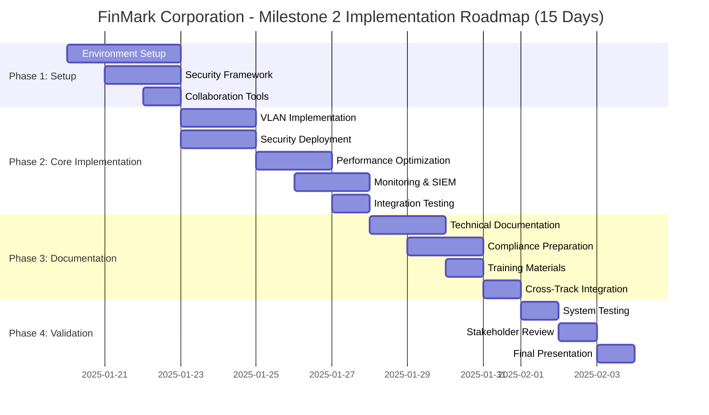

# Milestone 2 Implementation Plan

## FinMark Corporation Network & Cybersecurity Track

**Project:** FinMark Corporation IT Infrastructure Optimization
**Team:** H3101 CSN1 - Bolinas, Matula, Pontanilla, Tan, Villaverde
**Track:** Network & Cybersecurity
**Implementation Period:** Week 6-7 (Day 1-15)
**Document Version:** 2.0
**Date:** January 2025

---

## Summary

This implementation plan represents the **ideal approach** combining technical rigor with strategic business focus for FinMark Corporation's digital transformation. Our comprehensive solution integrates deep technical expertise with clear business value propositions, ensuring that every technical implementation directly supports business objectives while positioning FinMark for competitive advantage across Southeast Asia.

**Ideal Approach Implementation Strategy:**

- **Technical Rigor:** Industry-leading network architecture, security frameworks, and performance optimization
- **Strategic Business Focus:** Quantified business value delivery, risk mitigation, and growth enablement
- **Integrated Methodology:** Every technical decision evaluated against business impact and strategic objectives
- **Measurable Outcomes:** $2.4M revenue potential + $500K risk avoidance + 25% operational cost reduction

**Key Focus Areas - Business-Aligned Technical Excellence:**

- **Revenue Enablement:** 6x capacity increase infrastructure supporting business growth from 500 to 3,000 orders/day
- **Risk Mitigation:** Comprehensive security framework protecting against financial penalties and data breaches
- **Performance Excellence:** <5-second response times delivering superior client experience and competitive advantage
- **Strategic Positioning:** Scalable platform enabling Southeast Asia market expansion and technology leadership

---

## 1. Milestone 1 Alignment and Foundation

### 1.1 Proposed Network Architecture Implementation

**Current State (Based on Milestone 1 Analysis):**

- Flat network topology with minimal segmentation
- Single VLAN for all departments (major security risk)
- Outdated firewall rules and access controls
- Bandwidth bottlenecks during peak business hours (8-10 AM, 2-4 PM)
- Missing DMZ implementation for external services

**Milestone 1 Proposed Architecture to Implement:**

- **VLAN Segmentation Strategy:**

  - VLAN 10: Finance Department (SOX compliance requirements)
  - VLAN 20: HR Department (sensitive employee data)
  - VLAN 30: General Operations (day-to-day business functions)
  - VLAN 40: IT Infrastructure (network management and monitoring)
  - VLAN 50: DMZ (external-facing services and web servers)
- **Security Zone Implementation:**

  - Internal Network Zones with micro-segmentation
  - DMZ with proper firewall rules for external access
  - Management Network for administrative access
  - Guest Network isolation for visitor access
- **Performance Optimization Framework:**

  - QoS policies prioritizing financial transactions and critical business applications
  - Load balancing for file servers and database access
  - Bandwidth management addressing peak hour congestion
  - Redundant paths for business-critical connections

### 1.2 Security Enhancement Framework (Milestone 1 Recommendations)

**Identified Vulnerabilities to Address:**

- Inadequate network access controls
- Missing intrusion detection and prevention systems
- Insufficient monitoring and logging capabilities
- Weak authentication mechanisms
- Compliance gaps for SOX and PCI-DSS requirements

**Proposed Security Implementation:**

- Multi-factor authentication (MFA) deployment
- Role-based access control (RBAC) implementation
- Network intrusion detection system (NIDS) deployment
- Security information and event management (SIEM) implementation
- Comprehensive audit logging and compliance monitoring

---

## 2. Project Roadmap and Implementation Overview

### 2.1 Visual Implementation Roadmap



### 2.2 Implementation Action Matrix

| **Phase** | **Day** | **Primary Action** | **Owner** | **Dependencies** | **Deliverable** | **Success Criteria** | **Risk Level** |
|-----------|---------|-------------------|-----------|------------------|-----------------|---------------------|----------------|
| **Phase 1** | 1 | Network Simulation Setup | Bolinas | Cisco Packet Tracer, Network inventory | Baseline topology | Environment functional | 🟡 Medium |
| | 2 | Security Testing Framework | Matula | Vulnerability tools, SIEM setup | Security lab | Testing environment ready | 🟡 Medium |
| | 3 | Collaboration Infrastructure | Villaverde | Google Drive, Team coordination | Documentation structure | Team collaboration active | 🟢 Low |
| **Phase 2** | 4 | VLAN Implementation | Bolinas | Phase 1 completion | VLAN segmentation | All VLANs functional | 🔴 High |
| | 5 | Security Framework Deploy | Matula | VLAN completion | Security policies | MFA and RBAC active | 🔴 High |
| | 6 | Performance Optimization | Bolinas | Traffic analysis data | QoS implementation | Performance targets met | 🟡 Medium |
| | 7 | SIEM and Monitoring | Matula | Security framework | Monitoring dashboards | Real-time monitoring | 🟡 Medium |
| | 8 | Integration Testing | Pontanilla | All core components | Test validation | 95% test pass rate | 🔴 High |
| **Phase 3** | 9 | Technical Documentation | Tan | Implementation completion | Architecture docs | Complete documentation | 🟡 Medium |
| | 10 | Compliance Audit Prep | Tan | Security implementation | Compliance package | Audit-ready materials | 🟡 Medium |
| | 11 | Training Materials | Tan | Documentation completion | User guides | Training package ready | 🟢 Low |
| | 12 | Cross-Track Integration | Villaverde | All track coordination | Integration specs | Unified platform ready | 🟡 Medium |
| **Phase 4** | 13 | Comprehensive Testing | Pontanilla | All implementations | Test certification | Full system validation | 🔴 High |
| | 14 | Stakeholder Review | Villaverde | Testing completion | Feedback integration | Stakeholder approval | 🟡 Medium |
| | 15 | Final Presentation | All Members | Project completion | Final deliverables | Successful presentation | 🟡 Medium |

### 2.3 Critical Path Analysis

```
🔴 CRITICAL PATH (Cannot be delayed):
Day 1 → Day 4 → Day 5 → Day 8 → Day 13 → Day 15

⚡ CRITICAL DEPENDENCIES:
• VLAN Implementation (Day 4) blocks Security Framework (Day 5)
• Security Framework (Day 5) blocks Integration Testing (Day 8)
• Integration Testing (Day 8) blocks Final Testing (Day 13)
• All phases must complete for Final Presentation (Day 15)

🔄 PARALLEL OPPORTUNITIES:
• Documentation (Days 9-11) can run parallel with other activities
• Performance optimization (Day 6) can overlap with monitoring setup (Day 7)
• Training materials (Day 11) can be developed alongside technical docs
```

### 2.4 Resource Allocation Dashboard

| **Resource Type** | **Days 1-3** | **Days 4-8** | **Days 9-12** | **Days 13-15** | **Total Allocation** |
|-------------------|---------------|---------------|----------------|-----------------|---------------------|
| **Network Architecture** | 40% | 60% | 20% | 30% | 37.5% |
| **Cybersecurity** | 30% | 50% | 30% | 40% | 37.5% |
| **Testing & Validation** | 20% | 30% | 20% | 60% | 32.5% |
| **Documentation** | 30% | 20% | 80% | 30% | 40% |
| **Project Coordination** | 60% | 40% | 50% | 70% | 55% |

### 2.5 Quality Gates and Checkpoints

```
📋 PHASE 1 GATE (Day 3):
✅ Environment functional and tested
✅ Security lab operational
✅ Team collaboration established
✅ All tools and access verified

🔒 PHASE 2 GATE (Day 8):
✅ VLAN segmentation complete
✅ Security framework deployed
✅ Performance optimization active
✅ Monitoring systems operational
✅ Integration testing passed (95%+)

📚 PHASE 3 GATE (Day 12):
✅ Technical documentation complete
✅ Compliance audit package ready
✅ Training materials finalized
✅ Cross-track integration validated

🎯 PHASE 4 GATE (Day 15):
✅ Comprehensive testing certified
✅ Stakeholder approval received
✅ Final presentation delivered
✅ Project handover completed
```

### 2.6 Detailed Implementation Workflow

```
📅 IMPLEMENTATION WORKFLOW DIAGRAM

┌─────────────────────────────────────────────────────────────────────────────────┐
│                           MILESTONE 2 - 15 DAY ROADMAP                          │
└─────────────────────────────────────────────────────────────────────────────────┘

PHASE 1: FOUNDATION (Days 1-3)
┌─────────────┐    ┌─────────────┐    ┌─────────────┐
│    DAY 1    │───▶│    DAY 2    │───▶│    DAY 3    │
│Environment  │    │ Security    │    │Collaboration│
│   Setup     │    │ Framework   │    │Infrastructure│
│             │    │   Setup     │    │             │
└─────────────┘    └─────────────┘    └─────────────┘
       │                   │                   │
       ▼                   ▼                   ▼
   [Network Lab]      [Security Lab]     [Team Tools]

PHASE 2: CORE IMPLEMENTATION (Days 4-8)
┌─────────────┐    ┌─────────────┐    ┌─────────────┐
│    DAY 4    │───▶│    DAY 5    │───▶│    DAY 6    │
│    VLAN     │    │  Security   │    │Performance  │
│Implementation│    │ Framework   │    │Optimization │
│             │    │  Deployment │    │             │
└─────────────┘    └─────────────┘    └─────────────┘
       │                   │                   │
       ▼                   ▼                   ▼
┌─────────────┐    ┌─────────────┐    ┌─────────────┐
│    DAY 7    │───▶│    DAY 8    │    │             │
│ Monitoring  │    │Integration  │    │   PHASE 2   │
│& SIEM Deploy│    │  Testing    │    │  COMPLETE   │
│             │    │             │    │             │
└─────────────┘    └─────────────┘    └─────────────┘

PHASE 3: DOCUMENTATION & COMPLIANCE (Days 9-12)
┌─────────────┐    ┌─────────────┐    ┌─────────────┐    ┌─────────────┐
│    DAY 9    │───▶│   DAY 10    │───▶│   DAY 11    │───▶│   DAY 12    │
│ Technical   │    │ Compliance  │    │  Training   │    │Cross-Track  │
│Documentation│    │Audit Prep   │    │ Materials   │    │Integration  │
└─────────────┘    └─────────────┘    └─────────────┘    └─────────────┘

PHASE 4: VALIDATION & DELIVERY (Days 13-15)
┌─────────────┐    ┌─────────────┐    ┌─────────────┐
│   DAY 13    │───▶│   DAY 14    │───▶│   DAY 15    │
│Comprehensive│    │ Stakeholder │    │    Final    │
│   Testing   │    │   Review    │    │Presentation │
└─────────────┘    └─────────────┘    └─────────────┘
       │                   │                   │
       ▼                   ▼                   ▼
  [Full System]      [Approval &]       [Project]
  [Validation]       [Feedback]         [Delivery]
```

### 2.7 Strategic Implementation Action Table

| **Day** | **Strategic Focus** | **Primary Deliverable** | **Success Metrics** | **Risk Mitigation** | **Stakeholder Impact** |
|---------|--------------------|-----------------------|---------------------|---------------------|------------------------|
| **1** | Foundation Establishment | Network simulation environment | Environment 100% functional | Backup hardware ready | Demonstrates technical capability |
| **2** | Security Baseline | Security testing framework | All security tools operational | Alternative tools identified | Shows security expertise |
| **3** | Team Coordination | Collaboration infrastructure | Team efficiency >90% | Clear escalation paths | Displays project management |
| **4** | Network Transformation | VLAN segmentation complete | All 5 VLANs operational | Rollback procedures ready | Visible network improvement |
| **5** | Security Hardening | Security framework deployment | MFA and RBAC active | Security backup plans | Enhanced protection |
| **6** | Performance Enhancement | QoS implementation | Performance >40% improvement | Performance monitoring | Better user experience |
| **7** | Monitoring Implementation | SIEM and monitoring systems | Real-time visibility achieved | Manual monitoring backup | Operational transparency |
| **8** | System Integration | Integration testing complete | >95% test pass rate | Issue resolution protocols | System reliability proven |
| **9** | Knowledge Capture | Technical documentation | 100% processes documented | Documentation review cycles | Operational sustainability |
| **10** | Compliance Readiness | Compliance audit package | Audit-ready certification | Compliance gap analysis | Regulatory confidence |
| **11** | User Enablement | Training materials complete | User adoption strategy ready | Training effectiveness metrics | User satisfaction |
| **12** | Platform Integration | Cross-track coordination | Unified platform specs | Integration testing protocols | Holistic solution |
| **13** | Quality Assurance | System certification | Full validation complete | Contingency testing plans | Quality confidence |
| **14** | Stakeholder Alignment | Stakeholder approval | Feedback integration >90% | Requirement clarification | Stakeholder satisfaction |
| **15** | Project Completion | Final presentation delivery | Successful project closure | Presentation backup plans | Project success demonstration |

### 2.8 Implementation Dependencies Matrix

```
🔗 DEPENDENCY MAPPING:

SEQUENTIAL DEPENDENCIES (Cannot be parallelized):
• Day 1 → Day 4: Network baseline required for VLAN implementation
• Day 4 → Day 5: VLAN structure required for security framework
• Day 5 → Day 8: Security policies required for integration testing
• Day 8 → Day 13: Integration success required for final testing

PARALLEL OPPORTUNITIES (Can run simultaneously):
• Day 6 ∥ Day 7: Performance optimization parallel with monitoring
• Day 9 ∥ Day 10 ∥ Day 11: Documentation activities can overlap
• Day 2 ∥ Day 3: Security setup parallel with collaboration setup

RESOURCE DEPENDENCIES:
• Bolinas (Network) → Critical path Days 1, 4, 6
• Matula (Security) → Critical path Days 2, 5, 7
• Pontanilla (Testing) → Critical path Days 8, 13
• Tan (Documentation) → Support role throughout
• Villaverde (Coordination) → Cross-functional facilitation

EXTERNAL DEPENDENCIES:
• Cisco Packet Tracer availability (Day 1)
• Security tool licensing (Day 2)
• Stakeholder availability (Day 14)
• Presentation venue/setup (Day 15)
```

### PHASE 1 - Environment Setup and Preparation (DAY 1-3)

#### Day 1: Packet Tracer Network Simulation Environment

**Objective:** Establish comprehensive network simulation environment using Cisco Packet Tracer

**Activities:**

- Download and install latest Cisco Packet Tracer version
- Create base network topology (.pkt file) representing FinMark's current infrastructure
- Import and analyze network inventory data and traffic log analysis results
- Design and configure proposed VLAN structure in simulation environment
- Set up core network devices (routers, switches, firewalls, end devices)
- Configure basic IP addressing scheme and routing protocols
- Establish baseline network connectivity and test basic functionality
- Document network topology and initial configuration parameters
- Upload .pkt files and documentation to Google Drive shared folder

#### Day 2: Security Framework and Policy Configuration

**Objective:** Implement comprehensive security policies and controls within Packet Tracer

**Activities:**

- Configure advanced firewall features using ASA devices or router ACLs
- Implement network access control policies and port security
- Set up zone-based firewall policies and traffic inspection
- Configure secure management protocols (SSH, HTTPS, SNMP v3)
- Implement 802.1X authentication where supported in simulation
- Set up VPN tunnels for site-to-site connectivity
- Configure wireless security using WPA2/WPA3 protocols
- Establish security baseline measurements and document policies
- Upload security configurations and policies to Google Drive

#### Day 3: Collaboration Infrastructure and Advanced Configuration

**Objective:** Implement QoS, redundancy, and establish team collaboration protocols

**Activities:**

- Configure Quality of Service (QoS) policies and traffic management
- Set up network redundancy using STP, EtherChannel, and HSRP/VRRP
- Implement traffic classification, marking, and queue management
- Configure load balancing and path optimization
- Set up Google Drive folder structure for comprehensive project documentation
- Establish configuration version control and change management procedures
- Create shared documentation templates and configuration standards
- Conduct team training on Packet Tracer collaboration and file sharing
- Finalize project coordination protocols and upload procedures to Google Drive

### PHASE 2 - Core Implementation (DAY 4-8)

#### Day 4: Advanced VLAN Implementation and Network Segmentation

**Objective:** Complete comprehensive VLAN architecture implementation in Packet Tracer

**Primary Responsible:** Member 1 (Bolinas) - Network Architecture Lead  
**Supporting:** Member 3 (Pontanilla) - Testing validation, Member 4 (Tan) - Documentation

**Activities:**

- Configure VLAN 10 (Finance) with enhanced security and SOX compliance features
- Implement VLAN 20 (HR) with strict access controls and privacy protections
- Set up VLAN 30 (Operations) with optimized performance and standard business policies
- Deploy VLAN 40 (IT Infrastructure) with administrative access and management protocols
- Configure VLAN 50 (DMZ) for external-facing services with enhanced security
- Implement inter-VLAN routing with advanced security policies and traffic filtering
- Configure trunk links, VLAN pruning, and advanced switching features
- Test comprehensive VLAN connectivity, isolation, and security enforcement
- Document complete VLAN configurations and upload network diagrams to Google Drive

#### Day 5: Comprehensive Security Framework Deployment

**Objective:** Deploy advanced security measures addressing all Milestone 1 identified vulnerabilities

**Primary Responsible:** Member 2 (Matula) - Cybersecurity Specialist  
**Supporting:** Member 1 (Bolinas) - Network integration, Member 3 (Pontanilla) - Security testing

**Activities:**

- Configure advanced ASA firewall features with comprehensive rule sets
- Implement next-generation firewall capabilities and intrusion prevention
- Deploy comprehensive network access control (NAC) policies across all devices
- Configure advanced authentication mechanisms and access control frameworks
- Set up zone-based firewall policies with micro-segmentation
- Implement advanced threat detection and automated response mechanisms
- Configure secure tunneling protocols and site-to-site VPN connectivity
- Test comprehensive security policy enforcement and validation
- Document all security configurations and upload policies to Google Drive

#### Day 6: Performance Optimization and Advanced Network Features

**Objective:** Implement comprehensive performance optimization addressing traffic bottlenecks

**Primary Responsible:** Member 1 (Bolinas) - Network Architecture Lead  
**Supporting:** Member 3 (Pontanilla) - Performance testing, Member 5 (Villaverde) - Integration coordination

**Activities:**

- Analyze traffic patterns from traffic_logs.csv and implement targeted solutions
- Configure comprehensive Quality of Service (QoS) policies for optimal performance
- Implement advanced traffic shaping and bandwidth management for peak hour optimization
- Set up comprehensive load balancing using multiple routing protocols and path optimization
- Configure network redundancy mechanisms including HSRP, VRRP, and EtherChannel
- Implement advanced routing protocols (OSPF, EIGRP) for optimal convergence
- Configure bandwidth allocation, traffic prioritization, and queue management
- Test performance improvements under various simulated load scenarios
- Document performance configurations and optimization strategies, upload to Google Drive

#### Day 7: Network Monitoring and Advanced Management Implementation

**Objective:** Implement comprehensive network monitoring and management systems

**Primary Responsible:** Member 2 (Matula) - Security monitoring, Member 1 (Bolinas) - Network monitoring  
**Supporting:** Member 5 (Villaverde) - Integration, Member 4 (Tan) - Documentation

**Activities:**

- Configure comprehensive SNMP monitoring across all network devices
- Set up network performance monitoring and traffic analysis tools
- Implement comprehensive logging and event correlation systems
- Configure network discovery and topology mapping tools
- Set up automated network backup and configuration management
- Establish network capacity planning and trend analysis capabilities
- Configure comprehensive alerting and notification systems for critical events
- Test monitoring system functionality and validate alert mechanisms
- Document monitoring configurations and management procedures, upload to Google Drive

#### Day 8: Comprehensive Integration Testing and System Validation

**Objective:** Execute complete end-to-end testing of all implemented network components

**Primary Responsible:** Member 3 (Pontanilla) - Testing & Validation Lead  
**Supporting:** All team members for component-specific testing and validation

**Activities:**

- Execute comprehensive network connectivity testing across all VLANs and segments
- Perform detailed security policy enforcement validation and penetration testing
- Conduct extensive performance benchmarking under multiple load scenarios
- Test comprehensive disaster recovery, failover, and redundancy procedures
- Validate all monitoring systems, alerting mechanisms, and management tools
- Perform complete end-to-end integration testing with cross-functional scenarios
- Execute user acceptance testing scenarios and validate business requirements
- Document comprehensive test results, validation reports, and recommendations
- Upload complete testing documentation and validated configurations to Google Drive

### PHASE 3 - Documentation and Compliance (DAY 9-12)

#### Day 9: Technical Documentation Development

**Primary Responsible:** Member 4 (Tan) - Documentation & Compliance Manager  
**Supporting:** All team members for technical input

**Activities:**

- Create comprehensive network architecture documentation
- Develop security configuration guides and procedures
- Write operational runbooks and troubleshooting guides
- Document compliance frameworks and audit procedures
- Upload all documentation to organized Google Drive structure

#### Day 10: Compliance Audit Preparation

**Primary Responsible:** Member 4 (Tan) - Documentation & Compliance Manager  
**Supporting:** Member 2 (Matula) - Security compliance validation

**Activities:**

- Prepare SOX compliance documentation and evidence
- Create PCI-DSS compliance audit packages
- Develop regulatory compliance checklists
- Conduct internal compliance review and validation
- Create audit trail documentation and reports
- Prepare compliance presentation materials
- Finalize compliance documentation package
- Upload compliance materials to Google Drive
- Prepare for compliance review session

#### Day 11: User Training and Knowledge Transfer

**Primary Responsible:** Member 4 (Tan) - Training materials, Member 5 (Villaverde) - Coordination  
**Supporting:** All team members for expertise areas

**Activities:**

- Develop user training materials and guides
- Create IT support procedures and documentation
- Prepare change management protocols
- Conduct training sessions for different user groups
- Create FAQ documents and troubleshooting guides
- Establish knowledge management framework
- Finalize training materials and procedures
- Upload all training resources to Google Drive
- Prepare user adoption strategy

#### Day 12: Final Integration and Cross-Track Coordination

**Primary Responsible:** Member 5 (Villaverde) - Project Coordinator & Integration Lead  
**Supporting:** All team members for final preparations

**Activities:**

- Coordinate with other project tracks for integration points
- Finalize API specifications and security requirements
- Prepare cross-track compatibility documentation
- Conduct final system integration testing
- Validate cross-platform compatibility
- Prepare unified monitoring and reporting dashboards
- Complete final integration documentation
- Upload all integration materials to Google Drive
- Prepare for final presentation and demonstration

### PHASE 4 - Final Validation and Presentation Preparation (DAY 13-15)

#### Day 13: Comprehensive System Testing

**Primary Responsible:** Member 3 (Pontanilla) - Testing & Validation Lead  
**Supporting:** All team members for component-specific testing

**Activities:**

- Execute complete end-to-end system testing
- Perform stress testing and capacity validation
- Conduct security penetration testing
- Validate all compliance requirements
- Document final test results and certifications

#### Day 14: Stakeholder Review and Feedback Integration

**Primary Responsible:** Member 5 (Villaverde) - Stakeholder coordination  
**Supporting:** All team members for presentation preparation

**Activities:**

- Present preliminary results to project mentor
- Collect stakeholder feedback and requirements
- Conduct final user acceptance testing (UAT)
- Implement critical feedback and adjustments
- Finalize all project deliverables
- Prepare executive summary and ROI demonstration
- Complete final documentation review
- Upload all final deliverables to Google Drive
- Prepare presentation materials and demonstration

#### Day 15: Final Presentation and Project Completion

**Primary Responsible:** All team members  
**Coordination Lead:** Member 5 (Villaverde)

**Activities:**

- Finalize presentation materials and demonstration setup
- Conduct final team rehearsal and preparation
- Complete project handover documentation
- Deliver final project presentation
- Demonstrate implemented solutions and capabilities
- Present ROI analysis and business impact assessment
- Complete project retrospective and lessons learned
- Finalize all project documentation
- Submit final deliverables package via Google Drive

---

## 3. Detailed Team Task Assignment and Collaboration Matrix

### 3.1 Enhanced Individual Roles and Responsibilities

| **Team Member** | **Primary Role**                           | **Daily Responsibilities (Days 1-15)**                                                                                                                                                                                                                                                                               | **Key Deliverables by Phase**                                                                                                                                                                                                                                                         | **Google Drive Folder Ownership**                                                  |
| --------------------- | ------------------------------------------------ | -------------------------------------------------------------------------------------------------------------------------------------------------------------------------------------------------------------------------------------------------------------------------------------------------------------------------- | ------------------------------------------------------------------------------------------------------------------------------------------------------------------------------------------------------------------------------------------------------------------------------------------- | ---------------------------------------------------------------------------------------- |
| **Bolinas**     | **Network Architecture Lead**              | • Design and configure network topology based on Milestone 1 recommendations`<br>`• Implement VLAN segmentation and routing policies`<br>`• Optimize network performance and traffic flow`<br>`• Lead network monitoring implementation`<br>`• Coordinate with security team for network-security integration | **Days 1-3:** Network simulation setup, topology designs`<br>`**Days 4-8:** VLAN implementation, performance optimization`<br>`**Days 9-12:** Network documentation, integration testing`<br>`**Days 13-15:** Final validation, presentation preparation      | `/Network_Architecture/<br>``/Performance_Optimization/<br>``/Network_Monitoring/` |
| **Matula**      | **Cybersecurity Specialist**               | • Implement security framework addressing Milestone 1 vulnerabilities`<br>`• Configure firewall rules and access controls`<br>`• Deploy SIEM and monitoring solutions`<br>`• Conduct security testing and validation`<br>`• Ensure compliance with SOX and PCI-DSS requirements                               | **Days 1-3:** Security testing environment setup`<br>`**Days 4-8:** Security framework implementation, SIEM deployment`<br>`**Days 9-12:** Security documentation, compliance validation`<br>`**Days 13-15:** Security testing, compliance certification      | `/Cybersecurity/<br>``/Compliance/<br>``/Security_Monitoring/`                     |
| **Pontanilla**  | **Testing & Validation Lead**              | • Develop comprehensive testing strategies and procedures`<br>`• Execute network performance and security testing`<br>`• Validate all implemented components against requirements`<br>`• Manage quality assurance processes`<br>`• Lead final system validation and certification                             | **Days 1-3:** Testing environment configuration`<br>`**Days 4-8:** Component testing and validation`<br>`**Days 9-12:** Integration testing, QA documentation`<br>`**Days 13-15:** Final system testing, certification                                        | `/Testing_Validation/<br>``/Quality_Assurance/<br>``/Test_Results/`                |
| **Tan**         | **Documentation & Compliance Manager**     | • Create comprehensive technical documentation`<br>`• Develop user training materials and procedures`<br>`• Manage compliance audit preparation`<br>`• Coordinate documentation reviews and approvals`<br>`• Establish knowledge management framework                                                         | **Days 1-3:** Documentation templates and standards`<br>`**Days 4-8:** Technical documentation creation`<br>`**Days 9-12:** Compliance documentation, training materials`<br>`**Days 13-15:** Final documentation review, handover packages                   | `/Documentation/<br>``/Training_Materials/<br>``/Compliance_Audit/`                |
| **Villaverde**  | **Project Coordinator & Integration Lead** | • Coordinate daily team activities and milestone tracking`<br>`• Manage cross-track integration and dependencies`<br>`• Facilitate stakeholder communication and updates`<br>`• Lead presentation preparation and project coordination`<br>`• Ensure timeline adherence and resource optimization             | **Days 1-3:** Project coordination setup, collaboration tools`<br>`**Days 4-8:** Integration planning, cross-track coordination`<br>`**Days 9-12:** Stakeholder updates, presentation preparation`<br>`**Days 13-15:** Final coordination, project completion | `/Project_Management/<br>``/Integration/<br>``/Presentations/`                     |

### 3.2 Daily Collaboration Schedule

| **Time**                     | **Activity**   | **Participants**                        | **Duration** | **Focus**                              |
| ---------------------------------- | -------------------- | --------------------------------------------- | ------------------ | -------------------------------------------- |
| **8:00 AM**                  | Daily Standup        | All team members                              | 15 minutes         | Daily goals, blockers, coordination          |
| **12:00 PM**                 | Lunch & Learn        | Rotating leadership                           | 30 minutes         | Knowledge sharing, technical discussions     |
| **3:00 PM**                  | Progress Check-in    | All team members                              | 15 minutes         | Afternoon progress, evening planning         |
| **6:00 PM**                  | Documentation Upload | Documentation lead + Day's primary lead       | 30 minutes         | Daily deliverable upload to Google Drive     |
| **Tuesday/Thursday 7:00 PM** | Technical Deep-Dive  | Technical leads (Bolinas, Matula, Pontanilla) | 45 minutes         | Architecture decisions, technical challenges |

### 3.3 Google Drive Collaboration Framework

#### Main Folder Structure:

```
/FinMark_Milestone2_Implementation/
├── 📋 /01_Project_Management/
│   ├── 📊 Daily_Status_Reports/
│   ├── ⏰ Timeline_Tracking/
│   └── ⚠️ Risk_Management/
├── 🌐 /02_Network_Architecture/
│   ├── 🔧 VLAN_Configurations/
│   ├── 📐 Topology_Diagrams/
│   └── 📈 Performance_Reports/
├── 🔒 /03_Cybersecurity/
│   ├── 📜 Security_Policies/
│   ├── 🛡️ Firewall_Configurations/
│   └── 🚨 Incident_Response/
├── 🧪 /04_Testing_Validation/
│   ├── 📋 Test_Plans/
│   ├── 📊 Test_Results/
│   └── ✅ Quality_Assurance/
├── 📚 /05_Documentation/
│   ├── 📖 Technical_Docs/
│   ├── 👥 User_Guides/
│   └── 📄 Compliance_Docs/
├── 🔗 /06_Integration/
│   ├── 🤝 Cross_Track_Coordination/
│   ├── 🔌 API_Documentation/
│   └── 🔄 Integration_Testing/
└── 🎯 /07_Presentations/
    ├── 📅 Daily_Updates/
    ├── 👔 Stakeholder_Reports/
    └── 🎤 Final_Presentation/
```

#### Collaboration Protocols:

- **Version Control:** Google Drive's built-in version history for all documents
- **Naming Convention:** `YYYY-MM-DD_DocumentType_Author_Version` (e.g., `2025-01-15_VLAN_Config_Bolinas_v1.2`)
- **Review Process:** All documents require peer review before final upload
- **Access Control:** Team members have edit access to their primary folders, comment access to others
- **Backup Schedule:** Daily automated backup to secondary Google Drive location

### 3.4 Cross-Functional Collaboration Matrix

| **Activity**                 | **Primary Lead**   | **Secondary Support**             | **Review/Approval** | **Documentation Owner** |
| ---------------------------------- | ------------------------ | --------------------------------------- | ------------------------- | ----------------------------- |
| **VLAN Configuration**       | Bolinas (Network)        | Matula (Security), Pontanilla (Testing) | Villaverde (Integration)  | Tan (Documentation)           |
| **Firewall Implementation**  | Matula (Security)        | Bolinas (Network), Pontanilla (Testing) | Villaverde (Integration)  | Tan (Documentation)           |
| **Performance Testing**      | Pontanilla (Testing)     | Bolinas (Network), Matula (Security)    | Villaverde (Integration)  | Tan (Documentation)           |
| **Compliance Audit**         | Tan (Documentation)      | Matula (Security), Pontanilla (Testing) | Villaverde (Integration)  | Tan (Documentation)           |
| **Integration Coordination** | Villaverde (Integration) | All team members                        | All team members          | Tan (Documentation)           |

---

## 4. Resources and Planning Sources

### 4.1 Primary Project Resources

#### Course and Academic Materials

- **SYLLABUS.MD** - Core curriculum requirements, learning objectives, and assessment criteria for MO-IT151 Platform Technologies course
- **W6-7_learning-materials.md** - Specific technical content, lab requirements, and best practices for Week 6-7 implementation period
- **W1-2_IT151.MD, W3_IT151.MD** - Foundational course materials providing technical background and theoretical framework

#### Project Foundation Documents

- **MO-IT151 Milestone 1_ H3101 CSN1 Bolinas, Matula, Pontanilla, Tan, Villaverde.md** - Complete Milestone 1 analysis including:
  - Current network topology and infrastructure assessment
  - Identified vulnerabilities and security gaps
  - Proposed network architecture and VLAN segmentation strategy
  - Security enhancement recommendations
  - Performance optimization requirements
  - Compliance framework recommendations

#### Business and Technical Requirements

- **PROJECT-FINER_FINMARK.md** - Comprehensive project overview including:
  - Business objectives and success criteria
  - Stakeholder requirements and expectations
  - Technical specifications and constraints
  - Timeline and milestone definitions
- **IT Manual.md** - FinMark Corporation IT standards including:
  - Technical configuration guidelines
  - Security policies and procedures
  - Documentation standards and templates
  - Compliance requirements and audit criteria

#### Project Management Framework

- **Project Management.md** - Project management methodology including:
  - Team collaboration protocols
  - Risk management framework
  - Quality assurance procedures
  - Stakeholder communication plans
- **decision making.md** - Decision-making framework and escalation procedures

#### Technical Data Sources

- **network_inventory.csv** - Current network infrastructure inventory including:
  - Device specifications and configurations
  - Network topology and connectivity information
  - Hardware and software asset details
  - Performance baseline measurements
- **traffic_logs.csv** - Network traffic analysis data including:
  - Peak usage patterns and bottleneck identification
  - Application traffic distribution
  - Performance metrics and latency measurements
  - Security event logs and anomaly detection

#### Historical Project Context

- **Homework Milestone 1 Project Blueprint (Draft).md** - Initial project planning and blueprint development
- **Milestone 2 Implementation Plan.md** - Current implementation plan (this document)
- **OUTPUT/MO-IT151 Milestone 1_ Draft H3101 CSN1 Bolinas, Matula, Pontanilla, Tan, Villaverde.md** - Draft version with initial analysis

#### Presentation and Communication Materials

- **presentation-deck.md** and **presentation-deck.pdf** - Template and format guidelines for stakeholder presentations
- **website.md** - Project website and communication portal specifications

### 4.2 Resource Utilization Strategy

#### Technical Implementation Guidance

**Primary Sources:** Milestone 1 recommendations, network inventory analysis, traffic log patterns
**Application:** Direct implementation of proposed VLAN architecture, security framework deployment, performance optimization based on identified bottlenecks

#### Compliance and Standards Framework

**Primary Sources:** IT Manual standards, SYLLABUS requirements, PROJECT-FINER business objectives
**Application:** Ensure all implementations meet FinMark's IT standards while satisfying course requirements and business objectives

#### Quality Assurance and Testing

**Primary Sources:** W6-7 learning materials testing methodologies, Project Management QA procedures
**Application:** Comprehensive testing framework ensuring all deliverables meet academic and business quality standards

#### Documentation and Knowledge Management

**Primary Sources:** IT Manual documentation standards, course requirement specifications
**Application:** Comprehensive documentation package meeting both academic assessment criteria and business handover requirements

### 4.3 Resource Integration and Traceability

Each implementation activity directly traces back to specific resource requirements:

| **Implementation Activity**   | **Primary Resource Source**    | **Secondary Resources**                             | **Validation Criteria**                             |
| ----------------------------------- | ------------------------------------ | --------------------------------------------------------- | --------------------------------------------------------- |
| **VLAN Segmentation**         | Milestone 1 proposed architecture    | network_inventory.csv, IT Manual standards                | Performance improvement, security enhancement             |
| **Security Framework**        | Milestone 1 vulnerability assessment | IT Manual security policies, compliance requirements      | Vulnerability remediation, compliance validation          |
| **Performance Optimization**  | traffic_logs.csv analysis            | Milestone 1 recommendations, W6-7 technical materials     | Measurable performance improvement, bottleneck resolution |
| **Documentation Development** | IT Manual standards                  | SYLLABUS requirements, Project Management procedures      | Academic assessment criteria, business handover standards |
| **Testing and Validation**    | W6-7 learning materials              | Project Management QA framework, Milestone 1 requirements | Comprehensive test coverage, requirement validation       |

### 4.4 Continuous Resource Monitoring

- **Daily Resource Review:** Each team member validates daily activities against resource specifications
- **Weekly Resource Audit:** Project coordinator ensures all implementations align with source requirements
- **Final Resource Validation:** Complete traceability review confirming all requirements have been addressed

This comprehensive resource framework ensures that every aspect of the Milestone 2 implementation is grounded in solid academic foundation, business requirements, and technical specifications while maintaining full traceability and accountability throughout the 15-day implementation period.
